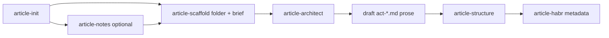

# Article assistant

A read-only router for the article-writing pipeline. The assistant runs one
script — `pipeline-status.mjs` — which spawns the other skills' `*-status.mjs`
scripts, inspects `.article-kit/` state, and returns a single
`recommendedSubagent`. The assistant then explains the stage to the user in
plain language and delegates to that subagent. It never edits article files
itself.

## Pipeline



`article-notes` is **optional**: the pipeline never blocks on it. The user can
skip notes and go straight to scaffold; notes can also be reopened later.

## Skill layout

```
<SKILL_DIR>/
├── SKILL.md
├── scripts/
│   ├── pipeline-status.mjs
│   └── pipeline-lib.mjs
└── assets/
    └── schemas/
        └── pipeline-state.schema.json
```

`<SKILL_DIR>` is the directory that contains this file, for example
`.cursor/skills/article-assistant/` when installed as Project through ide-agents.

## Quick start

Determine the current stage and the recommended next subagent:

```bash
node <SKILL_DIR>/scripts/pipeline-status.mjs --target . --json
```

With an explicit slug and intent:

```bash
node <SKILL_DIR>/scripts/pipeline-status.mjs --target . --slug my-article --intent notes --json
```

## Flags

| Flag | Effect |
|------|--------|
| `--target <path>` | Article workspace root; default is current working directory |
| `--slug <slug>` | Article folder name; unsafe characters are normalized |
| `--thread-title <title>` | Current IDE thread/chat title; normalized to recover or seed a slug |
| `--chat-title <title>` | Alias for `--thread-title` |
| `--language ru\|en` | Output language when no state can provide it |
| `--intent <i>` | Hint which stage the user wants: `auto` (default), `notes`, `scaffold`, `architect`, `structure`, `habr` |
| `--json` | Print machine-readable JSON |

## Output

`pipeline-status.mjs --json` returns a route object:

```json
{
  "action": "route",
  "slug": "my-article",
  "stage": "needs_brief",
  "recommendedSubagent": "article-scaffold",
  "optionalSubagents": ["article-notes"],
  "reason": "brief incomplete",
  "statusByPhase": {
    "notes": { "status": "absent" },
    "scaffold": { "status": "complete" },
    "brief": { "status": "needs_input" },
    "architect": { "ready": true, "complete": false },
    "draft": { "status": "needs_draft" },
    "structure": { "ready": false, "complete": false }
  },
  "next": { "recommendation": "Delegate to article-scaffold (brief flow) to finish the brief." }
}
```

When the workspace is not initialized, `stage` is `init` and
`recommendedSubagent` is `article-init`. When no slug can be recovered,
`action` is `needs_input` with a `currentQuestion` asking for the slug.

The schema at `assets/schemas/pipeline-state.schema.json` documents the
response shape; the assistant does not persist any state file.

## Routing rules

The script applies the first match in this order:

1. Workspace not initialized → `article-init`.
2. `--intent` is explicit (not `auto`) → the matching subagent (e.g. `notes` →
   `article-notes`). The user asked for it; honour it.
3. Notes state `status: "started"` → `article-notes` (resume).
4. Brief missing fields → `article-scaffold` (brief flow).
5. Brief blocked by missing scaffold folder → `article-scaffold` (folder).
6. Scaffold folder incomplete → `article-scaffold`.
7. Architect ready but not complete → `article-architect`.
8. `act-*.md` files have no drafted prose → `stage: "draft"`,
   `recommendedSubagent: null` (no bundled drafter yet; the assistant tells the
   user to draft prose and return).
9. Structure ready but not complete → `article-structure`.
10. Structure complete but Habr metadata not applied → `article-habr` (selects
    format, audience, complexity, hubs and tags, then writes them into
    `index.md`).
11. Structure and Habr metadata complete → `stage: "done"`, no subagent.

`optionalSubagents` lists `article-notes` for the scaffold/brief/architect
stages so the assistant can offer notes as a side path.

## Agent instructions

When the user is unsure which stage to run, says "continue the article", or
asks "what's next":

1. Resolve `<SKILL_DIR>` to this skill directory.
2. If the host exposes the current thread/chat title, pass it as
   `--thread-title "<current title>"`.
3. Run:

   ```bash
   node <SKILL_DIR>/scripts/pipeline-status.mjs --target . --json
   ```

   Add `--slug <slug>` when known and `--intent <stage>` when the user named a
   stage explicitly.
4. Read `recommendedSubagent`, `stage`, `reason`, and `statusByPhase` from the
   response.
5. Explain the current stage to the user in one or two sentences in the
   article's language. Do not dump `statusByPhase` raw.
6. Delegate to `recommendedSubagent` through the host's subagent mechanism
   (Task tool / `@article-<id>`), with a prompt that says "follow
   `agents/<recommendedSubagent>.md`". Do **not** call the recommended
   subagent's scripts yourself.
7. If `recommendedSubagent` is null (stage `draft` or `done`), tell the user
   what to do next in plain language (draft the acts, or publish).
8. If `optionalSubagents` includes `article-notes` and the user seems unsure
   about structure/climax, mention they can optionally run `article-notes`
   first — but never block on it.

## Output Contract

After routing, answer with:

```
Статья <slug>: этап <stage>.
Дальше: <recommendedSubagent или описание> — <reason>.
```

Keep it short. Do not repeat the full status JSON.

## Do not

- Do not edit any article files (`.article-kit/*`, `act-*.md`, `lead.md`,
  `index.md`, `three-act-outline.md`, `article-notes.md`); the assistant is
  read-only.
- Do not call other skills' `apply`/`answer`/`sync` scripts; delegate to the
  subagent that owns them.
- Do not block the pipeline on `article-notes`; it is optional.
- Do not override the script's route unless the user explicitly asks for a
  different stage (then re-run with `--intent`).
